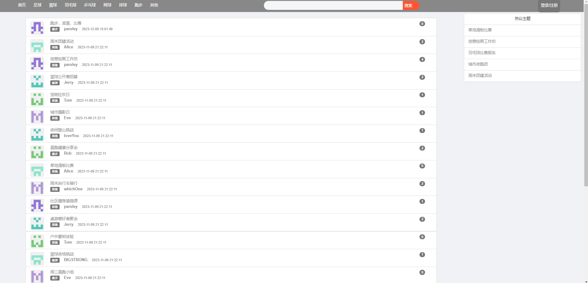
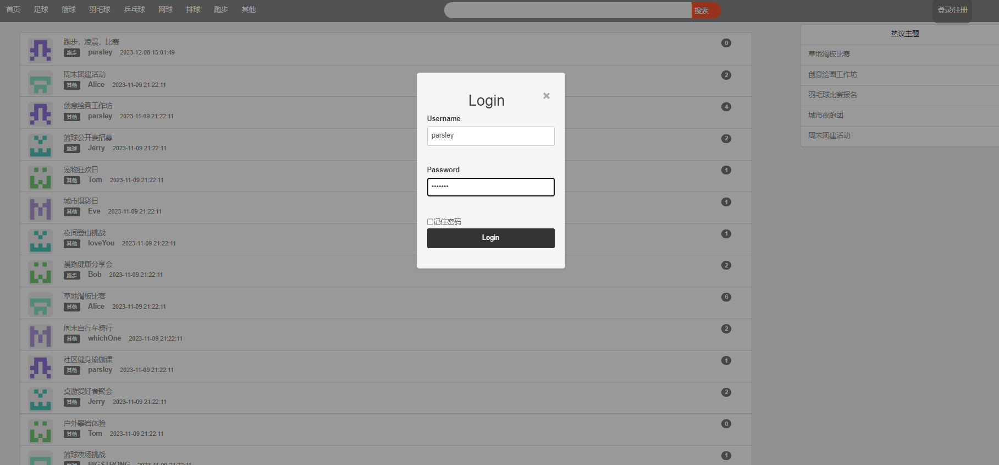
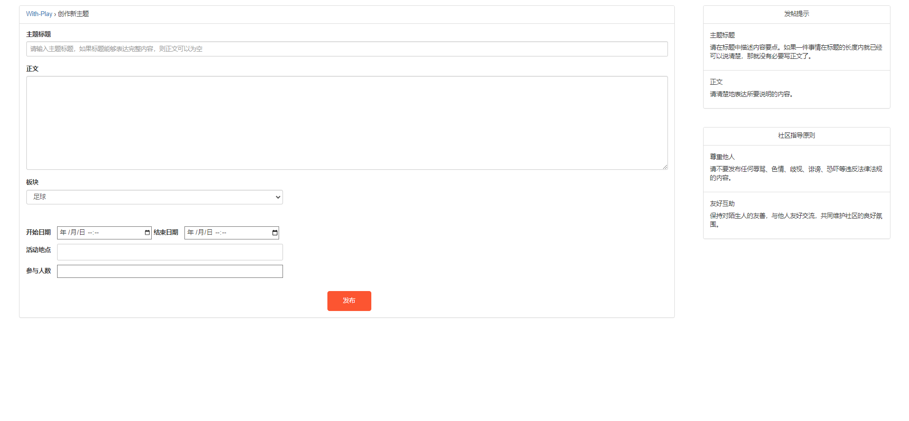
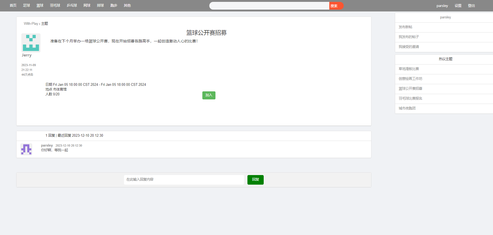
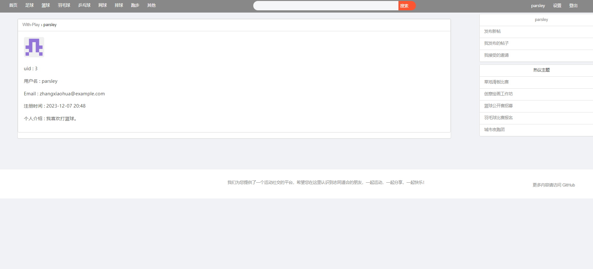

# with-play
与好友一起运动的论坛Web项目

## 简介

“与好友一起运动”的社交管理平台，实现的功能有发帖、回帖（发起活动）、加入/退出活动、取消活动、查看自身活动信息。

**此贴整体框架使用的是 https://github.com/withstars/Genesis**

## 使用技术

​	SpringBoot + MySql + jsp 

## 配置

修改 `src/resources/`目录下的`application.yml`、`application-druid.yml`，更改数据库连接。

注意如果你在`pom.xml`文件中使用了一些其他版本的`jar`包，有可能会导致`tomcat`版本不匹配，目前使用的`tomcat 10`

## 启动方式

直接运行 `MyApplication.java ` 就可以了

所有用户初始密码为 `user123` ，注意数据库用户密码由MD5加密。

## 界面

​															*首页*

​															*登录*

​															*发帖*

​															*查看帖子内容*

​															*个人信息*
